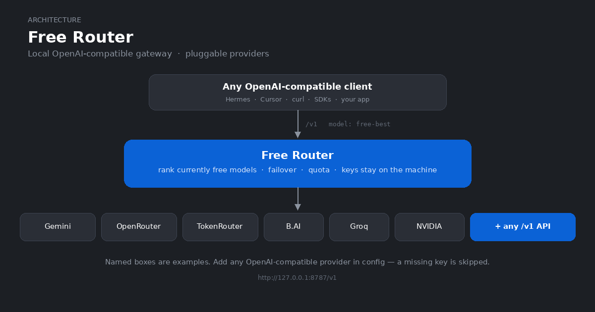

# Free Router

> [English](../../README.md) | 中文

<p align="center">
  
</p>

本地 OpenAI 兼容网关。
把任意客户端指向 `http://127.0.0.1:8787/v1` 并使用 `free-best`。
它会对你配置的**任意 OpenAI 兼容 provider** 的当前免费模型做排名。
遇到限流、宕机或空回复时自动 Failover。
缺 Key 的 provider 直接被跳过。

站点：[www222fff.github.io/free-router](https://www222fff.github.io/free-router/)

## 运行（Web UI 优先）

Node.js 20+。
克隆、启动，剩下的一切都在 Web UI 里做：

```bash
git clone https://github.com/www222fff/free-router.git
cd free-router
./ctl.sh start
```

打开 <http://127.0.0.1:8787/> 登录（默认密码 `admin123`）。
从这里开始，不需要碰任何配置文件：

- **渠道 tab**——粘贴 Key。
- 同一渠道多 Key 自动轮换，401 只退役那一个。
- **访问 tab**——给 `/v1/*` 客户端建网关 API Key。
- **路由 tab**——排每条路由试模型的顺序。
- **配额 tab**——日限额和用量历史。
- **设置 tab**——服务、发现、调优，以及**允许局域网访问**开关。

界面跟随浏览器语言（内置 12 种语言）。
`./ctl.sh stop` 停止，`./ctl.sh restart` 重启，`./ctl.sh status` 看状态。
详见[工作原理](HOW_IT_WORKS.md)。

## 局域网访问

设置 → **允许局域网访问**。
打开后会列出所有可达地址（`{lan-ip}`、`127.0.0.1`、`localhost`、`{hostname}`）。
暴露之前先做这两件事：

1. 在 Web UI（访问 tab）创建一个网关 API Key。
有了 Key 之后，`/v1/*` 要求 `Authorization: Bearer <key>`。
2. 改掉管理密码（设置 tab）。

调用方式和普通 OpenAI 接口一样，只是多一个 Key：

```bash
curl -s http://<lan-ip>:8787/v1/chat/completions \
  -H 'Content-Type: application/json' \
  -H 'Authorization: Bearer sk-fr-...' \
  -d '{"model": "free-best", "messages": [{"role": "user", "content": "hi"}]}'
```

## 项目结构

```text
app/            程序（server、providers、UI、config 模块）
app/cli/        list-models 命令
app/config/     tracked 默认值（config.json）
test/           单元 + 冒烟测试（仓库根跑 `npm test`）
data/           唯一可写目录（覆盖层、状态、.env 种子、日志）
script/         start/stop/models 脚本，systemd unit
docker/         Dockerfile、compose.yaml（生产基准）、compose.override.yaml（开发）
ctl.sh          总入口：start/stop/restart/service/docker/status
```

## 配置分层

`app/config/config.json` 只放默认值，保持可合并。
Web UI 里的一切改动都写进 gitignored 的 `data/config.local.json`。
启动时覆盖默认值（对象按 key 合并，数组整体替换）。
完整优先级（从高到低）：显式进程环境变量 → `data/config.local.json` → 首启 `.env` 种子 → `app/config/config.json`。

## 日常命令

```bash
./script/models.sh          # 当前 free-best 排序
./script/models.sh --usage  # 今日配额
```

## Key 一览

| 变量 | 获取位置 |
| --- | --- |
| `GEMINI_API_KEY` | [Google AI Studio](https://aistudio.google.com/apikey) |
| `OPENROUTER_API_KEY` | [openrouter.ai/keys](https://openrouter.ai/keys) |
| `TOKENROUTER_API_KEY` | TokenRouter |
| `BAI_API_KEY` | [chat.b.ai](https://chat.b.ai) |

同一渠道多个 Key：`OPENROUTER_API_KEYS`（或 `OPENROUTER_API_KEY_KEYS`）逗号分隔。
也可以在 Web UI 里添加命名 Key，请求会自动轮换。
加新渠道：在 Web UI 里只填名字和 base URL，或在 `app/config/config.json` 里加一段。

## `.env`（可选）

Web UI 是主要配置方式，`.env` 只是便利种子。
`mkdir -p data && cp .env.example data/.env`，填上 Key。
局域网再加 `FREE_ROUTER_HOST=0.0.0.0`。
首启内容会被迁移进 `data/config.local.json`，之后 `.env` 彻底忽略，UI 改的一定生效。
显式进程环境变量永远最高。
Provider Key 也可以直接走环境变量，Key 可以完全不落文件。
